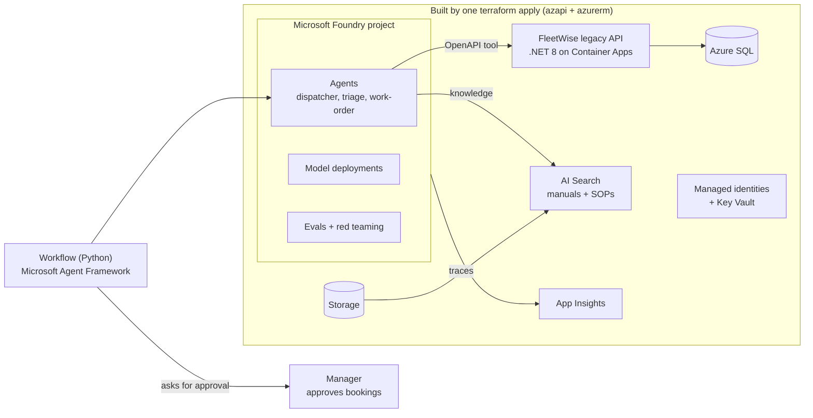
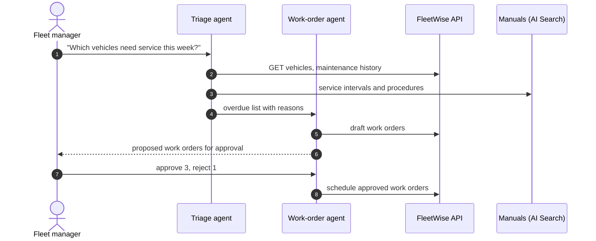

# Your Legacy App Just Got a Brain: FleetWise Agents on Microsoft Foundry

Build, test, and trust AI agents on top of an existing application with [Microsoft Foundry](https://learn.microsoft.com/azure/foundry/). The legacy FleetWise .NET API stays unchanged; agents reach it through its OpenAPI contract, ground answers in maintenance manuals, hand off work between agents with a human approval step, and are evaluated and red-teamed before anyone trusts them.

> The companion Spec Kit demo lives in [spec-kit-fleetwise](https://github.com/hkaanturgut/spec-kit-fleetwise).

## Quick start

```bash
az login
SUBSCRIPTION_ID=<your-subscription-id> scripts/deploy.sh eastus2   # Terraform + image build + .env
python3 -m venv .venv && . .venv/bin/activate && pip install -r requirements.txt
python -m src.agents.setup_agents          # creates the agent versions and the manuals vector store
scripts/preflight.sh
python -m src.agents.dispatch_workflow     # two agents + manager approval
python -m evals.run v1 && python -m evals.run v2   # break-fix proof
```

## Target architecture

One `terraform apply` builds the platform. A bootstrap script creates the agents, because agents live in the Foundry data plane.



## Agent flow with a human in the loop



## Planned layout

| Path | Purpose |
| --- | --- |
| `infra/` | Terraform root, modules (`foundation`, `foundry`, `knowledge`, `legacy`, `identity`), `demo.tfvars` |
| `src/legacy-api/` | Pinned copy of the FleetWise API, containerized |
| `src/agents/` | Python agents and the approval workflow |
| `data/` | Seed SQL, maintenance manuals and SOPs |
| `evals/` | Quality datasets and red-team prompts |
| `scripts/` | bootstrap, seed, preflight, reset, destroy |

## License

[MIT](LICENSE)
