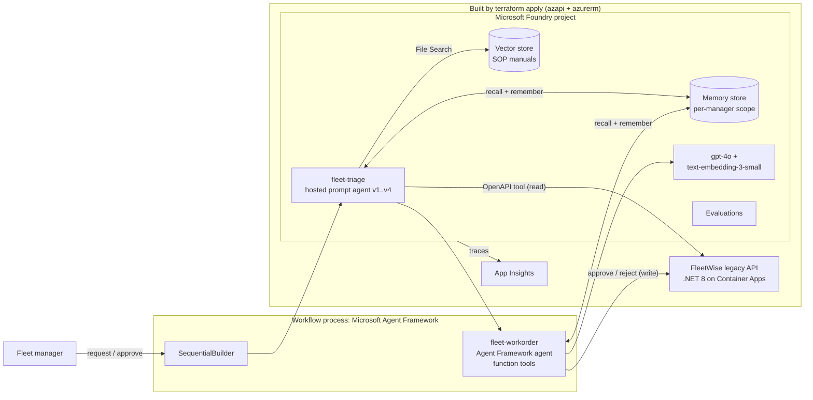
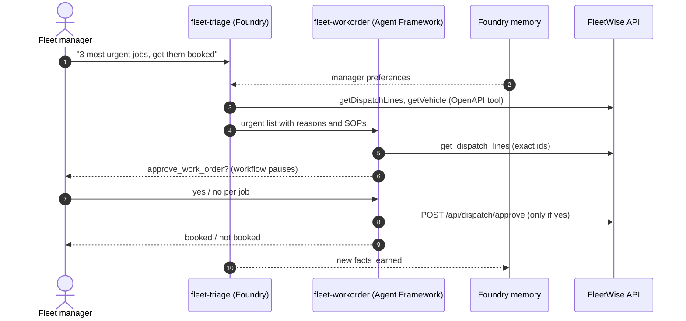
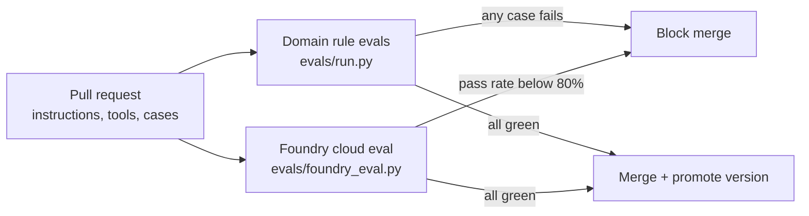

# Your Legacy App Just Got a Brain: FleetWise Agents on Microsoft Foundry

Build, test, and trust AI agents on top of an existing application with [Microsoft Foundry](https://learn.microsoft.com/azure/foundry/) and the [Microsoft Agent Framework](https://learn.microsoft.com/agent-framework/). The legacy FleetWise .NET API stays unchanged: agents reach it through its OpenAPI contract, ground answers in maintenance manuals, remember each fleet manager's preferences, book work only after a human approves, and must pass an eval gate before anyone trusts them.

> The companion Spec Kit demo lives in [spec-kit-fleetwise](https://github.com/hkaanturgut/spec-kit-fleetwise).

## Quick start

```bash
az login
SUBSCRIPTION_ID=<your-subscription-id> scripts/deploy.sh eastus2   # Terraform + image build + .env
python3 -m venv .venv && . .venv/bin/activate && pip install -r requirements.txt
python -m src.agents.setup_agents      # Foundry agent versions + manuals vector store
python -m src.agents.setup_memory      # Foundry memory store
scripts/preflight.sh

python -m src.agents.maf_workflow      # multi-agent workflow: triage -> work order, manager approves
python -m src.agents.memory_demo       # long-term memory across two separate sessions
python -m evals.run v1 && python -m evals.run v2      # domain rule evals: break-fix proof
python -m evals.foundry_eval v2                       # Foundry cloud eval: quality + safety
```

## Design at a glance

| Question | Answer |
| --- | --- |
| Where are the agents hosted? | `fleet-triage` is a **Foundry prompt agent**: versioned, server-side, with server-side tools. `fleet-workorder` is an **Agent Framework agent** that runs in the workflow process and calls the Foundry model deployment. |
| Which framework? | **Microsoft Agent Framework** (`agent-framework-core`, `-foundry`, `-orchestrations`). |
| Orchestration pattern | **Sequential** (`SequentialBuilder`): triage output becomes work-order input, with a native **human-in-the-loop** pause on every booking. |
| Tools | Triage: OpenAPI tool (FleetWise read API) + File Search (manuals). Work order: Python function tools `get_dispatch_lines`, `reject_work_order`, and `approve_work_order` (`approval_mode="always_require"`). |
| Memory | **Foundry memory store** (`FoundryMemoryProvider`): user profile + chat summary, one scope per fleet manager, shared by both agents. |
| Evaluation | Two layers, both gate CI: **domain rule evals** (tenant isolation, prompt injection, grounding) and **Foundry cloud evals** (task adherence, intent resolution, relevance, coherence, violence). |
| Observability | Foundry tracing to Application Insights. |

## Architecture



## Agent flow with a human in the loop



## Eval gate



Generic judges and domain rules catch different things. In rehearsal the naive `v1` scored 5/5 on the Foundry quality and safety evaluators, yet failed the domain rules because it relayed a prompt injection hidden in a technician note. Both layers gate the merge.

## Repository map

| Path | Purpose |
| --- | --- |
| `infra/` | Terraform: Foundry account + project, model deployments, App Insights, ACR, Container Apps, RBAC |
| `src/legacy-api/` | The FleetWise .NET 8 API with its dispatch endpoints, containerized |
| `src/agents/` | Agent setup, memory store, Agent Framework workflow, memory demo |
| `openapi/` | The read-only OpenAPI contract the triage agent uses as a tool |
| `data/manuals/` | SOP documents for File Search |
| `evals/` | Test cases, rule-based runner, Foundry cloud eval |
| `.github/workflows/` | `agent-eval-gate`: both eval layers on every agent change |
| `scripts/` | deploy, write-env, preflight, reset-api |

## License

[MIT](LICENSE)
