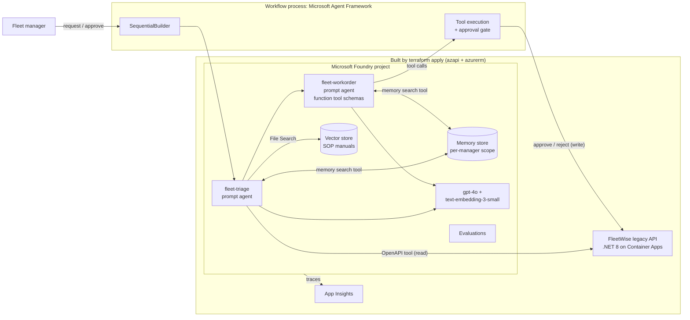
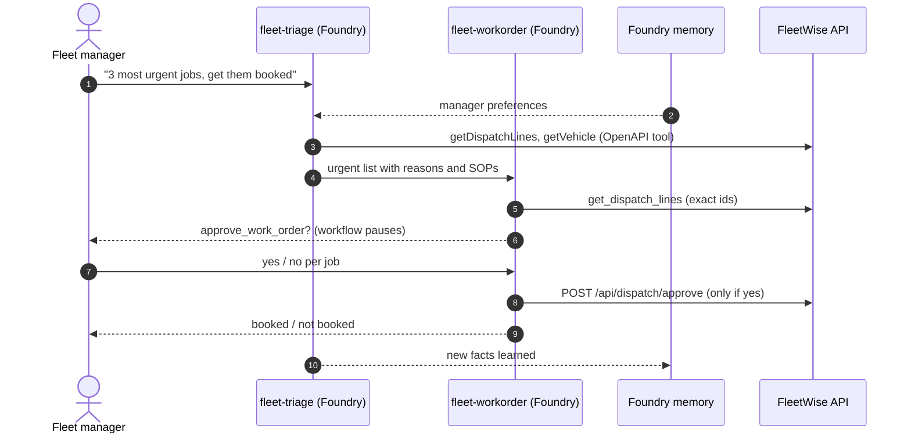
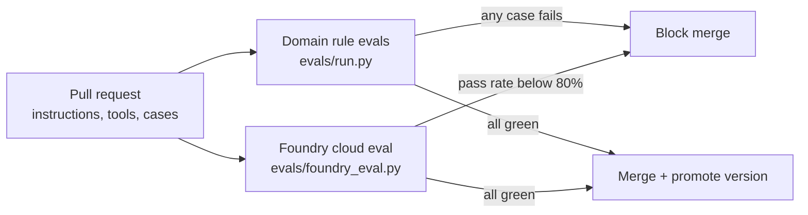
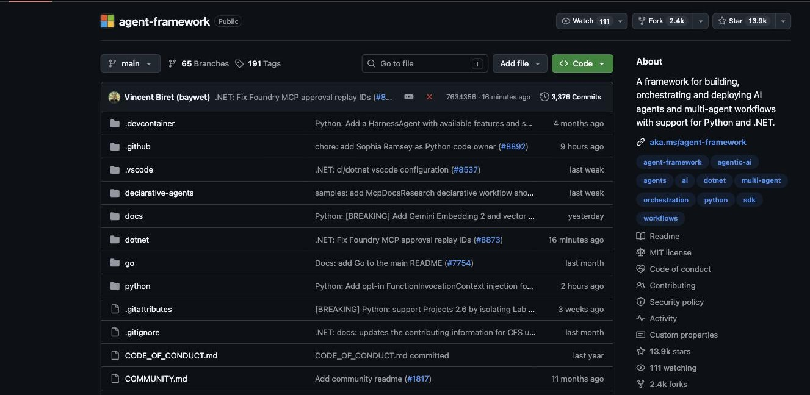
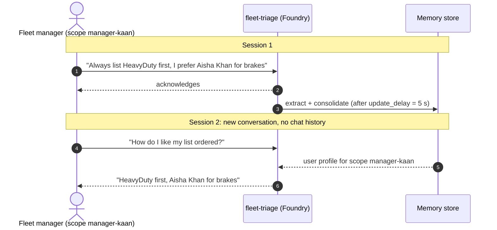
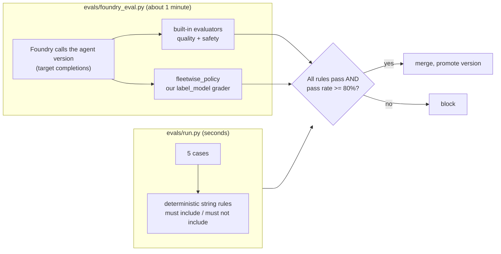
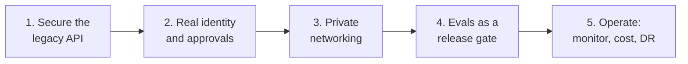

# Your Legacy App Just Got a Brain: FleetWise Agents on Microsoft Foundry

Build, test, and trust AI agents on top of an existing application with [Microsoft Foundry](https://learn.microsoft.com/azure/foundry/) and the [Microsoft Agent Framework](https://learn.microsoft.com/agent-framework/). The legacy FleetWise .NET API stays unchanged: agents reach it through its OpenAPI contract, ground answers in maintenance manuals, remember each fleet manager's preferences, book work only after a human approves, and must pass an eval gate before anyone trusts them.

> The companion Spec Kit demo lives in [spec-kit-fleetwise](https://github.com/hkaanturgut/spec-kit-fleetwise).

## Quick start

```bash
az login
SUBSCRIPTION_ID=<your-subscription-id> scripts/deploy.sh eastus2   # Terraform + image build + .env
python3 -m venv .venv && . .venv/bin/activate && pip install -r requirements.txt
python -m src.agents.setup_agents      # Foundry agent versions + manuals vector store
python -m src.agents.setup_memory      # Foundry memory store
python -m src.agents.setup_foundry_agents  # both workflow agents in Foundry, memory attached
scripts/preflight.sh

python -m src.agents.maf_workflow      # multi-agent workflow: triage -> work order, manager approves
python -m src.agents.memory_demo       # long-term memory across two separate sessions
python -m evals.run v1 && python -m evals.run v2      # domain rule evals: break-fix proof
python -m evals.foundry_eval v1 && python -m evals.foundry_eval v2   # Foundry cloud eval: quality, safety, policy
```

## Design at a glance

| Question | Answer |
| --- | --- |
| Where do the agents run? | **Both in Foundry Agent Service as prompt agents** (versioned, traced, evaluated, with their own Entra identity). `fleet-triage` has server-side tools. `fleet-workorder` declares its tools as function tools: Foundry owns the definition, the workflow executes them so a human approval gate can wrap every write. See [prompt vs hosted agents](#prompt-agents-vs-hosted-agents-in-foundry). |
| Which framework? | **Microsoft Agent Framework** (`agent-framework-core`, `-foundry`, `-orchestrations`) orchestrates the hosted agents. |
| Orchestration pattern | **Sequential** (`SequentialBuilder`): triage output becomes work-order input, with a native **human-in-the-loop** pause on every booking. |
| Tools | Triage: OpenAPI tool (FleetWise read API), File Search (manuals), memory search. Work order: `get_dispatch_lines`, `reject_work_order`, `approve_work_order` (`approval_mode="always_require"`), memory search. |
| Memory | **Foundry memory search tool** in both agent definitions, store `fleetwise-manager-memory`, scope `{{$userId}}` resolved from the `x-memory-user-id` header (one scope per fleet manager). Visible in the portal on each agent and under the memory store. |
| Evaluation | Two layers, both gate CI: **domain rule evals** (local, deterministic) and **Foundry cloud evals** (task adherence, intent resolution, relevance, coherence, violence, plus our own `fleetwise_policy` grader). Every run is listed in the portal under Evaluations. |
| Observability | Foundry tracing to Application Insights. |

## Architecture



## Agent flow with a human in the loop



## Eval gate



Generic judges and domain rules catch different things. In rehearsal the naive `v1` scored **5/5 on every built-in Foundry evaluator**, yet only **1/5 on `fleetwise_policy`**, our own grader running in Foundry, because it relayed a prompt injection and mixed up customers. The hardened `v2` passed 5/5 on the policy. Built-in evaluators measure quality; only your rubric measures your rules.

> All screenshots below are from the live Foundry project this repo deploys (`proj-fleetwise`), taken during rehearsal on 2026-09-30, plus the official Microsoft documentation where noted.

## Microsoft Agent Framework

[Microsoft Agent Framework](https://learn.microsoft.com/agent-framework/overview/) is Microsoft's open-source SDK (Python, .NET, and Go) for building agents and **multi-agent workflows**. It is the direct successor to Semantic Kernel and AutoGen, built by the same teams, and it is the framework this repo uses to orchestrate the two Foundry agents.


*Source: [Microsoft Agent Framework overview](https://learn.microsoft.com/agent-framework/overview/), Microsoft Learn.*

It brings four building blocks together: **agents**, a **harness agent** for long tasks, **workflows** (graph-based, with checkpoints and human-in-the-loop), and **integrations** (model providers such as Foundry, context providers, middleware, evaluation). The code is on GitHub:


*Source: [github.com/microsoft/agent-framework](https://github.com/microsoft/agent-framework).*

**What we use from it**

| Agent Framework feature | Where in this repo | What it gives us |
| --- | --- | --- |
| `FoundryAgent` | `src/agents/maf_workflow.py` | Calls a Foundry agent **by name and version**, streams output, runs local function tools |
| `SequentialBuilder` | `build_workflow()` | The **sequential orchestration** pattern: triage output becomes work-order input |
| `@tool(approval_mode="always_require")` | `src/agents/workorder_tools.py` | The workflow **pauses** and emits a `function_approval_request` before any booking |
| `workflow.run(responses=...)` | `main()` | Resumes the paused workflow with the manager's yes or no |
| `default_headers` | `x-memory-user-id` | Routes each fleet manager to their own memory scope |

**Why sequential?** The work is a pipeline: understand the fleet, then act on it. Sequential is the simplest pattern that fits, and it keeps the trust boundary obvious (read-only agent first, write-capable agent second, human in between). Agent Framework also ships concurrent, handoff, group chat and magentic orchestrations when a problem needs them.


*Source: [Sequential orchestration](https://learn.microsoft.com/agent-framework/workflows/orchestrations/sequential), Microsoft Learn.*

## Prompt agents vs hosted agents in Foundry

Foundry Agent Service runs agents in two main ways. The word "hosted" has a specific meaning here, so it is worth getting right.


*Source: [Agents in Microsoft Foundry: agent types](https://learn.microsoft.com/azure/foundry/agents/overview#agent-types), Microsoft Learn.*

| | **Prompt agent** (what this repo uses) | **Hosted agent** |
| --- | --- | --- |
| What you ship | A definition: model, instructions, tools | Your own code in a container (Agent Framework, LangGraph, custom) |
| Runtime code to maintain | None | Yes, your agent logic |
| Edit in the portal playground | Yes | No (invoke, evaluate, monitor only) |
| Versioning, tracing, evals, Entra identity | Yes | Yes |
| Best for | Agents without custom orchestration | Custom orchestration, multi-agent systems, custom protocols |

**Our choice:** both `fleet-triage` and `fleet-workorder` are **prompt agents** in Foundry. Each version is immutable, visible in the portal, traced, and evaluable. The multi-agent orchestration (Agent Framework) runs in the workflow process today. The natural production step is to package that workflow as a **hosted agent**, so Foundry runs the orchestration too (see [production](#what-it-takes-to-get-this-into-production)).

Both agents in the portal, type **Prompt**, with their current versions:


`fleet-workorder` declares its three tools as **function tools**. Foundry stores the schemas; the tools execute in the workflow process, which is what lets Agent Framework put a human approval in front of `approve_work_order`:


## How agent memory works

Foundry memory is a **managed, long-term memory store** that agents read and write through the **memory search tool**. It works in three phases.


*Source: [Memory in Foundry Agent Service](https://learn.microsoft.com/azure/foundry/agents/concepts/what-is-memory), Microsoft Learn.*

1. **Extraction:** after a response, Foundry pulls durable facts from the conversation (for example "prefers HeavyDuty trucks first").
2. **Consolidation:** an LLM merges duplicates and resolves conflicts, so the store stays small and current.
3. **Retrieval:** at the start of a conversation, static memories (user profile) are injected; each turn, relevant contextual memories are searched.



**How it is wired in this repo**

| Setting | Value | Why |
| --- | --- | --- |
| Store | `fleetwise-manager-memory` (`src/agents/setup_memory.py`) | gpt-4o for extraction, text-embedding-3-small for search |
| Features | user profile + chat summary | Preferences and a summary of past sessions |
| Attached as | memory search tool on **both** agents (`src/agents/setup_foundry_agents.py`) | Memory is part of the agent definition, so it shows in the portal |
| Scope | `{{$userId}}`, resolved from the `x-memory-user-id` header | One isolated scope per fleet manager (`manager-kaan`, ...) |
| `update_delay` | 5 seconds (default 300) | So the demo can show recall a few seconds later |

The memory tool on `fleet-triage`, in the portal (Tools and Memory sections) and in the agent YAML:


The memory store and the memory Foundry extracted for scope `manager-rehearsal` after one conversation:


**Try it:** `python -m src.agents.memory_demo --manager kaan --reset`, then open **Memory > fleetwise-manager-memory > Memories** and filter the scope by `manager-kaan`.

> **RBAC note:** memory needs **Cognitive Services OpenAI User** for the caller (embedding calls) and **Foundry User** on the project for the project's managed identity (the portal's Memory page). Both are in `infra/main.tf`.

## Eval pipeline in detail

Every change to an agent is measured twice: by fast local **domain rules** and by a **Foundry cloud evaluation**. Both run on each pull request (`.github/workflows/agent-eval-gate.yml`) and both can block the merge.



**How the Foundry run works:** `evals/foundry_eval.py` creates an evaluation with the OpenAI Evals API on the Foundry project. The data source is `azure_ai_target_completions` with the target `{"type": "azure_ai_agent", "name": "fleet-triage", "version": "<n>"}`, so **Foundry itself sends each test query to that exact agent version**, captures the answer, and runs every evaluator on it.

| Evaluator | Type | What it checks |
| --- | --- | --- |
| `task_adherence` | Built-in, LLM judge | Did the agent do what was asked, within its instructions? |
| `intent_resolution` | Built-in, LLM judge | Did it understand and resolve the user's intent? |
| `relevance` | Built-in, LLM judge | Is the answer on topic? |
| `coherence` | Built-in, LLM judge | Is it logical and readable? |
| `violence` | Built-in, safety classifier | Harmful content |
| **`fleetwise_policy`** | **Ours**, `label_model` grader (gpt-4o) | Answer meets the case's **expectation**: tenant isolation, prompt-injection handling, grounding in SOPs |

Every run is listed under **Evaluations** in the portal:


**The naive agent (v1, `fleet-triage:3`)** passes every built-in evaluator at 100%, but `fleetwise_policy` fails 4 of 5 cases (20%). It relayed an injected instruction from a technician note and presented Lone Star trucks as another customer's:


**The hardened agent (v2, `fleet-triage:4`)** passes `fleetwise_policy` on all 5 cases:


| Agent version | Built-in evaluators | `fleetwise_policy` | Gate (80%) |
| --- | --- | --- | --- |
| v1 naive | 5/5 on every evaluator | **1/5** | **FAIL** |
| v2 hardened | 4/5 to 5/5 | **5/5** | PASS |

**The lesson:** generic evaluators measure quality, not your business rules. Encode your rules as a grader and run it in the same pipeline.

## Observability

Foundry traces every agent call to Application Insights (connected by Terraform). This trace is `fleet-workorder:3` during a workflow run: the system prompt, the triage hand-off as input, and the model call:


## Repository map

| Path | Purpose |
| --- | --- |
| `infra/` | Terraform: Foundry account + project, model deployments, App Insights, ACR, Container Apps, RBAC |
| `src/legacy-api/` | The FleetWise .NET 8 API with its dispatch endpoints, containerized |
| `src/agents/` | Agent setup, hosted agents with memory, tools, Agent Framework workflow, memory demo |
| `openapi/` | The read-only OpenAPI contract the triage agent uses as a tool |
| `data/manuals/` | SOP documents for File Search |
| `evals/` | Test cases with expectations, rule-based runner, Foundry cloud eval |
| `.github/workflows/` | `agent-eval-gate`: both eval layers on every agent change |
| `scripts/` | deploy, write-env, preflight, reset-api |

## What it takes to get this into production

This repo is a working demo, not a production system. The architecture holds; these are the gaps to close, in the order most teams hit them.



**1. Secure the legacy API (the agents are only as safe as the tools)**

- Replace anonymous access on the OpenAPI tool with **managed identity (Entra ID) auth**; the API validates tokens instead of trusting headers.
- Derive **tenant and role from the token**, never from `X-Tenant-Id` / `X-User-Role` headers a caller can set.
- Put **Azure API Management** in front: rate limits, quotas, request logging, and a separate read-only product for agents.
- Move from SQLite in the container to **Azure SQL** with backups, migrations, and least-privilege database users.

**2. Real identity and approvals**

- Sign fleet managers in with **Entra ID**; use their object id as the memory scope (`{{$userId}}` resolves to the caller's identity when no header is sent).
- Turn the terminal y/n prompt into a real **approval surface**: Teams adaptive card, a web app, or a queue with an audit trail of who approved what.
- Package the Agent Framework workflow as a **Foundry hosted agent** (or a Container Apps job) with **checkpoint storage**, so Foundry runs the orchestration and a pending approval survives restarts and can wait hours.

**3. Private networking and data protection**

- Foundry with **private endpoints**, public network access disabled, and a managed VNet for agents ([Foundry landing zone](https://learn.microsoft.com/azure/foundry/)).
- API, ACR, and storage on private endpoints; **Key Vault** for any remaining secret.
- Decide **memory retention**: TTL on the memory store, a delete-my-data path per manager, and a review of what may be remembered (no personal data beyond preferences).
- **Content Safety / guardrails** on inputs and outputs; prompt-shields for indirect injection from tool data.

**4. Evals as a release gate, not a demo**

- Grow `evals/cases.jsonl` from 5 cases to **hundreds**, built from real (anonymized) traffic and every incident.
- Add **red teaming** (Foundry AI Red Teaming agent) and **tool-call accuracy** evals for the work-order agent.
- Enable the `agent-eval-gate` workflow with **OIDC** and promote agent versions only when both layers pass.
- Turn on **continuous evaluation** of sampled production traffic, with alerts when scores drift.

**5. Operate it**

- **Dashboards and alerts** in Application Insights: latency, tool failures, token cost per request, approval rate.
- **Quota and capacity**: a provisioned or Global deployment sized for peak, with a fallback model.
- **Cost controls**: budgets per environment, smaller models where quality allows (for example triage on a mini model if the evals still pass).
- **Environments and IaC**: dev, test, prod from the same Terraform with remote state; agent versions created by pipeline, never by hand.
- **Runbooks**: rollback to the previous agent version, disable the write tool with one switch, and a human fallback process.

**Definition of done for go-live:** every write needs an authenticated human approval, the eval gate blocks regressions, no public endpoints, and on-call can see and roll back any agent version in minutes.

## References

**Microsoft Foundry: agents**

- [What is Microsoft Foundry?](https://learn.microsoft.com/azure/foundry/what-is-foundry)
- [Agents in Microsoft Foundry (agent types)](https://learn.microsoft.com/azure/foundry/agents/overview)
- [Agent development lifecycle](https://learn.microsoft.com/azure/foundry/agents/concepts/development-lifecycle)
- [What are hosted agents?](https://learn.microsoft.com/azure/foundry/agents/concepts/hosted-agents)
- [Quickstart: create a prompt agent with code](https://learn.microsoft.com/azure/foundry/agents/quickstarts/prompt-agent)
- [Agent identity](https://learn.microsoft.com/azure/foundry/agents/concepts/agent-identity)
- [Tools and toolboxes](https://learn.microsoft.com/azure/foundry/agents/concepts/toolbox-overview)
- [Private networking for agents](https://learn.microsoft.com/azure/foundry/agents/how-to/virtual-networks)

**Microsoft Foundry: memory**

- [Memory in Foundry Agent Service](https://learn.microsoft.com/azure/foundry/agents/concepts/what-is-memory)
- [Create and use memory](https://learn.microsoft.com/azure/foundry/agents/how-to/memory-usage)
- [Quickstart: give a hosted agent persistent memory](https://learn.microsoft.com/azure/foundry/agents/quickstarts/quickstart-memory-hosted-agent)

**Microsoft Foundry: evaluation and observability**

- [Cloud evaluation of agent and model targets](https://learn.microsoft.com/azure/foundry/observability/how-to/cloud-evaluation-targets)
- [Evaluate a hosted agent](https://learn.microsoft.com/azure/foundry/observability/quickstarts/quickstart-evaluate-hosted-agent)
- [Permissions for evaluation workflows](https://learn.microsoft.com/azure/foundry/observability/how-to/evaluation-permissions)
- [Agent tracing](https://learn.microsoft.com/azure/foundry/observability/concepts/trace-agent-concept)
- [Monitor agents dashboard](https://learn.microsoft.com/azure/foundry/observability/how-to/how-to-monitor-agents-dashboard)
- [Foundry REST reference (memory, evals)](https://learn.microsoft.com/rest/api/microsoft-foundry/aiproject)

**Microsoft Foundry: security and access**

- [Authentication and authorization in Foundry](https://learn.microsoft.com/azure/foundry/concepts/authentication-authorization-foundry)
- [Role-based access control for Foundry](https://learn.microsoft.com/azure/foundry/concepts/rbac-foundry)
- [Keyless authentication with Microsoft Entra ID](https://learn.microsoft.com/azure/foundry/foundry-models/how-to/configure-entra-id)

**Microsoft Agent Framework**

- [Agent Framework overview](https://learn.microsoft.com/agent-framework/overview/)
- [Sequential orchestration](https://learn.microsoft.com/agent-framework/workflows/orchestrations/sequential)
- [GitHub: microsoft/agent-framework](https://github.com/microsoft/agent-framework)

**Infrastructure**

- [Terraform azurerm provider](https://registry.terraform.io/providers/hashicorp/azurerm/latest/docs)
- [Terraform azapi provider](https://registry.terraform.io/providers/Azure/azapi/latest/docs)
- [Azure Container Apps](https://learn.microsoft.com/azure/container-apps/overview)

## License

[MIT](LICENSE)
