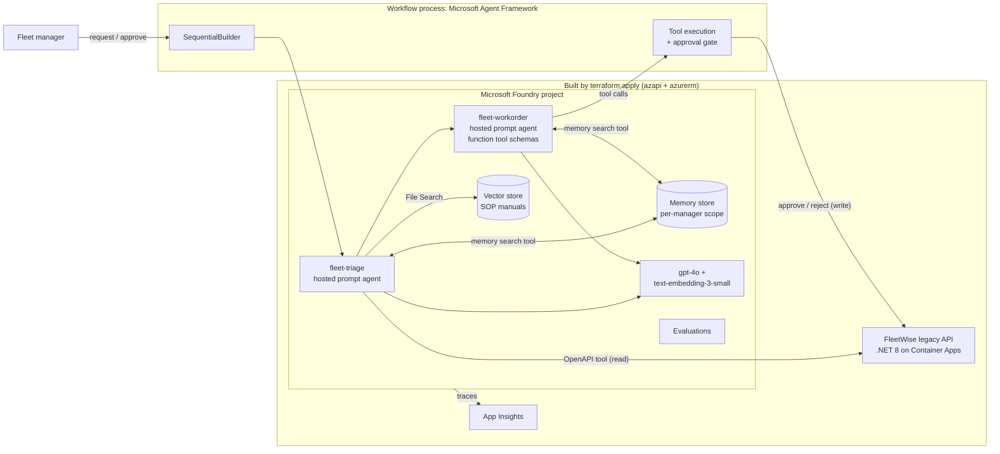
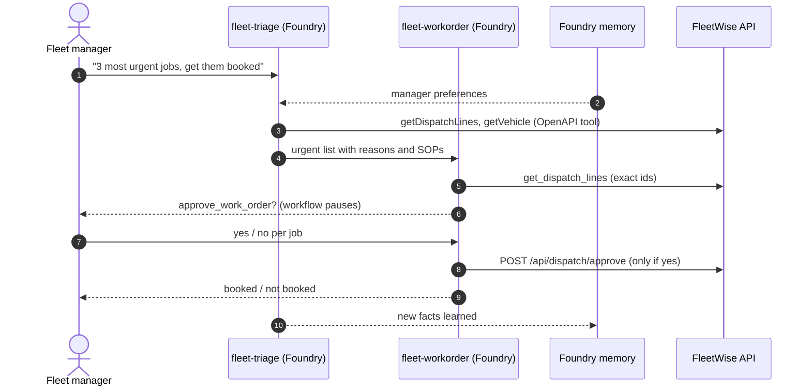
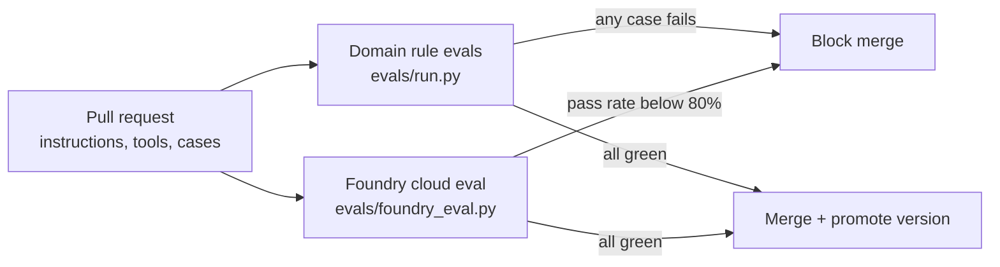
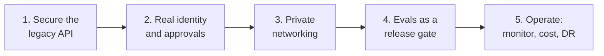

# Your Legacy App Just Got a Brain: FleetWise Agents on Microsoft Foundry

Build, test, and trust AI agents on top of an existing application with [Microsoft Foundry](https://learn.microsoft.com/azure/foundry/) and the [Microsoft Agent Framework](https://learn.microsoft.com/agent-framework/). The legacy FleetWise .NET API stays unchanged: agents reach it through its OpenAPI contract, ground answers in maintenance manuals, remember each fleet manager's preferences, book work only after a human approves, and must pass an eval gate before anyone trusts them.

> The companion Spec Kit demo lives in [spec-kit-fleetwise](https://github.com/hkaanturgut/spec-kit-fleetwise).

## Quick start

```bash
az login
SUBSCRIPTION_ID=<your-subscription-id> scripts/deploy.sh eastus2   # Terraform + image build + .env
python3 -m venv .venv && . .venv/bin/activate && pip install -r requirements.txt
python -m src.agents.setup_agents      # Foundry agent versions + manuals vector store
python -m src.agents.setup_memory      # Foundry memory store
python -m src.agents.setup_hosted_agents   # both workflow agents hosted in Foundry, memory attached
scripts/preflight.sh

python -m src.agents.maf_workflow      # multi-agent workflow: triage -> work order, manager approves
python -m src.agents.memory_demo       # long-term memory across two separate sessions
python -m evals.run v1 && python -m evals.run v2      # domain rule evals: break-fix proof
python -m evals.foundry_eval v1 && python -m evals.foundry_eval v2   # Foundry cloud eval: quality, safety, policy
```

## Design at a glance

| Question | Answer |
| --- | --- |
| Where are the agents hosted? | **Both in Foundry**, as versioned prompt agents. `fleet-triage` has server-side tools. `fleet-workorder` declares its tools as function tools: Foundry owns the definition, the workflow executes them so a human approval gate can wrap every write. |
| Which framework? | **Microsoft Agent Framework** (`agent-framework-core`, `-foundry`, `-orchestrations`) orchestrates the hosted agents. |
| Orchestration pattern | **Sequential** (`SequentialBuilder`): triage output becomes work-order input, with a native **human-in-the-loop** pause on every booking. |
| Tools | Triage: OpenAPI tool (FleetWise read API), File Search (manuals), memory search. Work order: `get_dispatch_lines`, `reject_work_order`, `approve_work_order` (`approval_mode="always_require"`), memory search. |
| Memory | **Foundry memory search tool** in both agent definitions, store `fleetwise-manager-memory`, scope `{{$userId}}` resolved from the `x-memory-user-id` header (one scope per fleet manager). Visible in the portal on each agent and under the memory store. |
| Evaluation | Two layers, both gate CI: **domain rule evals** (local, deterministic) and **Foundry cloud evals** (task adherence, intent resolution, relevance, coherence, violence, plus our own `fleetwise_policy` grader). Every run is listed in the portal under Evaluations. |
| Observability | Foundry tracing to Application Insights. |

## Architecture



## Agent flow with a human in the loop



## Eval gate



Generic judges and domain rules catch different things. In rehearsal the naive `v1` scored **5/5 on every built-in Foundry evaluator**, yet only **1/5 on `fleetwise_policy`**, our own grader running in Foundry, because it relayed a prompt injection and mixed up customers. The hardened `v2` passed 5/5 on the policy. Built-in evaluators measure quality; only your rubric measures your rules.

## Repository map

| Path | Purpose |
| --- | --- |
| `infra/` | Terraform: Foundry account + project, model deployments, App Insights, ACR, Container Apps, RBAC |
| `src/legacy-api/` | The FleetWise .NET 8 API with its dispatch endpoints, containerized |
| `src/agents/` | Agent setup, hosted agents with memory, tools, Agent Framework workflow, memory demo |
| `openapi/` | The read-only OpenAPI contract the triage agent uses as a tool |
| `data/manuals/` | SOP documents for File Search |
| `evals/` | Test cases with expectations, rule-based runner, Foundry cloud eval |
| `.github/workflows/` | `agent-eval-gate`: both eval layers on every agent change |
| `scripts/` | deploy, write-env, preflight, reset-api |

## What it takes to get this into production

This repo is a working demo, not a production system. The architecture holds; these are the gaps to close, in the order most teams hit them.



**1. Secure the legacy API (the agents are only as safe as the tools)**

- Replace anonymous access on the OpenAPI tool with **managed identity (Entra ID) auth**; the API validates tokens instead of trusting headers.
- Derive **tenant and role from the token**, never from `X-Tenant-Id` / `X-User-Role` headers a caller can set.
- Put **Azure API Management** in front: rate limits, quotas, request logging, and a separate read-only product for agents.
- Move from SQLite in the container to **Azure SQL** with backups, migrations, and least-privilege database users.

**2. Real identity and approvals**

- Sign fleet managers in with **Entra ID**; use their object id as the memory scope (`{{$userId}}` resolves to the caller's identity when no header is sent).
- Turn the terminal y/n prompt into a real **approval surface**: Teams adaptive card, a web app, or a queue with an audit trail of who approved what.
- Run the workflow in a durable host (**Container Apps job, Azure Functions durable, or a Foundry hosted agent**) with **checkpoint storage**, so a pending approval survives restarts and can wait hours.

**3. Private networking and data protection**

- Foundry with **private endpoints**, public network access disabled, and a managed VNet for agents ([Foundry landing zone](https://learn.microsoft.com/azure/foundry/)).
- API, ACR, and storage on private endpoints; **Key Vault** for any remaining secret.
- Decide **memory retention**: TTL on the memory store, a delete-my-data path per manager, and a review of what may be remembered (no personal data beyond preferences).
- **Content Safety / guardrails** on inputs and outputs; prompt-shields for indirect injection from tool data.

**4. Evals as a release gate, not a demo**

- Grow `evals/cases.jsonl` from 5 cases to **hundreds**, built from real (anonymized) traffic and every incident.
- Add **red teaming** (Foundry AI Red Teaming agent) and **tool-call accuracy** evals for the work-order agent.
- Enable the `agent-eval-gate` workflow with **OIDC** and promote agent versions only when both layers pass.
- Turn on **continuous evaluation** of sampled production traffic, with alerts when scores drift.

**5. Operate it**

- **Dashboards and alerts** in Application Insights: latency, tool failures, token cost per request, approval rate.
- **Quota and capacity**: a provisioned or Global deployment sized for peak, with a fallback model.
- **Cost controls**: budgets per environment, smaller models where quality allows (for example triage on a mini model if the evals still pass).
- **Environments and IaC**: dev, test, prod from the same Terraform with remote state; agent versions created by pipeline, never by hand.
- **Runbooks**: rollback to the previous agent version, disable the write tool with one switch, and a human fallback process.

**Definition of done for go-live:** every write needs an authenticated human approval, the eval gate blocks regressions, no public endpoints, and on-call can see and roll back any agent version in minutes.

## License

[MIT](LICENSE)
